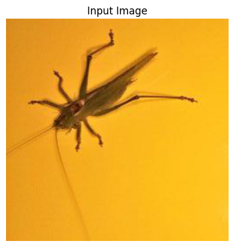
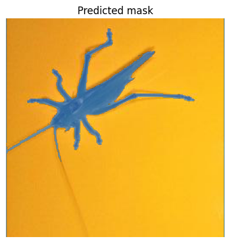

# Usage

## Quick Start - Process Images with InsectSAM

To use InsectSAM on your dataset, you can follow this script that demonstrates how to load the model, process images, and get the results in an output folder. The script uses the **Hugging Face Transformers** library and **PyTorch**:

<a href="https://colab.research.google.com/github/martintmv-git/RB-IBDM/blob/main/Image%20Processing%20Scripts/InsectSAM/insectsam_script.ipynb" target="_parent">
  
</a>

**[InsectSAM Script in RB-IBDM's GitHub](https://github.com/martintmv-git/RB-IBDM/tree/main/Image%20Processing%20Scripts/InsectSAM)**

## Installation and Setup

To begin using InsectSAM, you'll need to install the necessary dependencies and download the model from Hugging Face. Follow these steps:

1. Clone InsectSAM model repository - https://huggingface.co/martintmv/InsectSAM:

   ```python
   git lfs install # Install git-lfs if you haven't already (https://git-lfs.com)
   git clone https://huggingface.co/martintmv/InsectSAM 
   ```

2. Create a virtual environment with **conda** or **venv** and install the required dependencies. **Always** use a virtual environment to manage dependencies. A virtual environment helps to keep dependencies required by different projects separate by creating isolated Python virtual environments for them. Links to [conda](https://conda.io/projects/conda/en/latest/user-guide/install/index.html) and [venv](https://docs.python.org/3/library/venv.html).

   ```python
   python -m venv insectsam-env
   source insectsam-env/bin/activate
   pip install -r InsectSAM/requirements.txt
   ```

   The `requirements.txt` file contains:
   
      ```python
      transformers # Hugging Face Transformers library
      torch # PyTorch
      opencv-python # OpenCV
      Pillow # Python Imaging library
      numpy # NumPy
      requests # HTTP library
      matplotlib # Plotting library
      jupyterlab # JupyterLab for running notebooks
      ```

3. Set up the InsectSAM model:

   ```python
   from transformers import AutoModelForImageSegmentation, AutoProcessor

   model = AutoModelForImageSegmentation.from_pretrained("martintmv/InsectSAM")
   processor = AutoProcessor.from_pretrained("martintmv/InsectSAM")
   ```

**Tip**: Use this Jupyter Notebook - [Run InsectSAM using Transformers 🤗](https://github.com/martintmv-git/RB-IBDM/blob/main/InsectSAM/Run_InsectSAM_Inference_Transformers.ipynb)

<a href="https://colab.research.google.com/github/martintmv-git/RB-IBDM/blob/main/InsectSAM/Run_InsectSAM_Inference_Transformers.ipynb" target="_parent">
  
</a>

Once you have the model set up, you can start using it to perform semantic segmentation on insect images. Here's a quick example to get you started:

1. **Load the model and processor:**
   ```python
   import torch
   from transformers import SamModel, SamProcessor

   device = "cuda" if torch.cuda.is_available() else "cpu"

   processor = SamProcessor.from_pretrained("martintmv/InsectSAM")
   model = SamModel.from_pretrained("martintmv/InsectSAM").to(device)
   ```

2. **Load an image:**
   ```python
   from PIL import Image
   import requests

   url = "URL_TO_YOUR_IMAGE"
   image = Image.open(requests.get(url, stream=True).raw)

   # Display the image
   import matplotlib.pyplot as plt

   plt.imshow(image)
   plt.title("Input Image")
   plt.axis("off")
   plt.show()
   ```

3. **Generate a bounding box for the image:**
   ```python
   def get_bounding_box(image):
       # Simulate a bounding box in the center of the image
       width, height = image.size
       x_min, x_max = width // 4, 3 * width // 4
       y_min, y_max = height // 4, 3 * height // 4
       return [[[float(x_min), float(y_min), float(x_max), float(y_max)]]]

   input_boxes = get_bounding_box(image)
   ```

4. **Prepare inputs for the model:**
   ```python
   inputs = processor(image, input_boxes=input_boxes, return_tensors="pt").to(device)
   for k, v in inputs.items():
       print(k, v.shape)
   ```
5. **Perform segmentation:**
   ```python
   with torch.no_grad():
       outputs = model(**inputs, multimask_output=False)
   ```

6. **Post-process and visualize the results:**
   ```python
   # Apply sigmoid
   insectsam_seg_prob = torch.sigmoid(outputs.pred_masks.squeeze(1))
   # Convert soft mask to hard mask
   insectsam_seg_prob = insectsam_seg_prob.cpu().numpy().squeeze()
   insectsam_seg = (insectsam_seg_prob > 0.5).astype(np.uint8)

   def show_mask(mask, ax, random_color=False):
       if random_color:
           color = np.concatenate([np.random.random(3), np.array([0.6])], axis=0)
       else:
           color = np.array([30/255, 144/255, 255/255, 0.6])
       h, w = mask.shape[-2:]
       mask_image = mask.reshape(h, w, 1) * color.reshape(1, 1, -1)
       ax.imshow(mask_image)

   fig, axes = plt.subplots()
   axes.imshow(np.array(image))
   show_mask(insectsam_seg, axes)
   axes.title.set_text("Predicted Mask")
   axes.axis("off")
   plt.show()
   ```


## Example Inferences

Here's an example of how the model segments an image with the code from above and from [here](https://github.com/martintmv-git/RB-IBDM/blob/main/InsectSAM/Run_InsectSAM_Inference_Transformers.ipynb).

<a href="https://colab.research.google.com/github/martintmv-git/RB-IBDM/blob/main/InsectSAM/Run_InsectSAM_Inference_Transformers.ipynb" target="_parent">
  
</a>

|  |  |
|:--------------------------------------------------:|:--------------------------------------------------:|

## Further Reading

To dive deeper into the capabilities and advanced usage of InsectSAM, refer to the following resources:

- [InsectSAM Model Page on Hugging Face](https://huggingface.co/martintmv/InsectSAM)
- [InsectSAM Demo App on Hugging Face](https://huggingface.co/spaces/martintmv/InsectSAM)
- [HF Transformers Documentation](https://huggingface.co/transformers/)
- [PyTorch Documentation](https://pytorch.org/docs/stable/index.html)