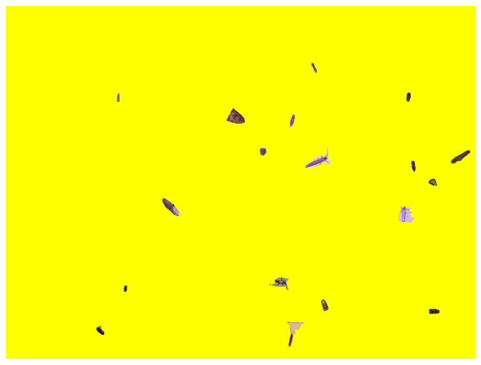
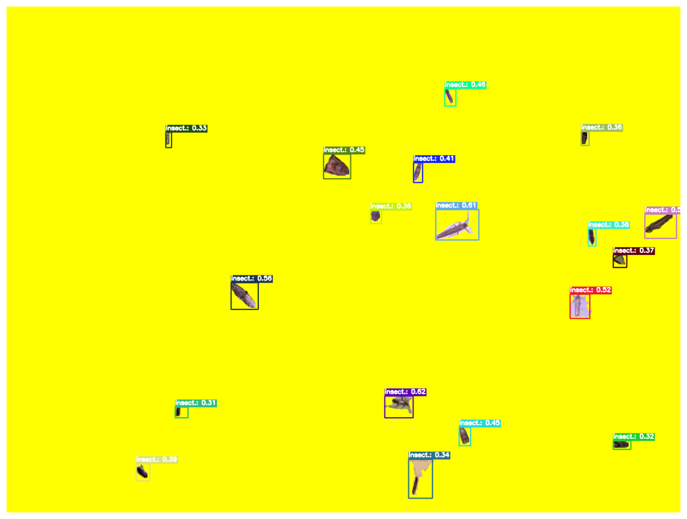

# InsectSAM & GroundingDINO

<a href="https://colab.research.google.com/github/martintmv-git/RB-IBDM/blob/main/InsectSAM/InsectSAM_GroundingDINO.ipynb" target="_parent">
  
</a>

Combining InsectSAM with GroundingDINO for text-based mask generation.
- This page can be found implemented as a Jupyter Notebook [here](https://github.com/martintmv-git/RB-IBDM/blob/main/InsectSAM/InsectSAM_GroundingDINO.ipynb).


# InsectSAM with GroundingDINO for Text-Based Mask Generation

We combine two advanced models - InsectSAM and Grounding DINO - to generate segmentation masks based on text prompts. Grounding DINO generates bounding boxes based on text prompts, and InsectSAM generates the corresponding segmentation masks. This implementation is based on the popular Grounded Segment Anything project, streamlined using the Transformers library.

- Grounded Segment Anything [repository on GitHub](https://github.com/IDEA-Research/Grounded-Segment-Anything).

- Refer to the paper for more details: [Grounded Segment Anything](https://arxiv.org/abs/2401.14159).

- Gradio demo using this method: [InsectSAM on Hugging Face](https://huggingface.co/spaces/martintmv/InsectSAM).

## Set-up Environment

First, we need to install the required dependencies. The `transformers` library from Hugging Face provides the necessary models and tools.

```python
!pip install --upgrade -q git+https://github.com/huggingface/transformers # Installs the latest version
```

## Imports

We import all the necessary libraries and modules for this project. This includes image processing libraries (`cv2`, `PIL`), data handling libraries (`torch`, `numpy`), and visualization libraries (`plotly`, `matplotlib`).

```python
import random
from dataclasses import dataclass
from typing import Any, List, Dict, Optional, Union, Tuple

import cv2
import torch
import requests
import numpy as np
from PIL import Image
import plotly.express as px
import matplotlib.pyplot as plt
import plotly.graph_objects as go
from transformers import AutoModelForMaskGeneration, AutoProcessor, pipeline
```

## Result Utils

### Bounding Box and Detection Result Classes

We define two dataclasses, `BoundingBox` and `DetectionResult`, to store the detection results. `BoundingBox` stores the coordinates of the bounding box, while `DetectionResult` stores the detection score, label, bounding box, and an optional mask.

```python
@dataclass
class BoundingBox:
    xmin: int
    ymin: int
    xmax: int
    ymax: int

    @property
    def xyxy(self) -> List[float]:
        return [self.xmin, self.ymin, self.xmax, self.ymax]

@dataclass
class DetectionResult:
    score: float
    label: str
    box: BoundingBox
    mask: Optional[np.array] = None

    @classmethod
    def from_dict(cls, detection_dict: Dict) -> 'DetectionResult':
        return cls(score=detection_dict['score'],
                   label=detection_dict['label'],
                   box=BoundingBox(xmin=detection_dict['box']['xmin'],
                                   ymin=detection_dict['box']['ymin'],
                                   xmax=detection_dict['box']['xmax'],
                                   ymax=detection_dict['box']['ymax']))
```

## Plot Utils

### Annotate Function

The `annotate` function takes an image and a list of detection results, then draws the bounding boxes and masks on the image. It converts the image to OpenCV format, iterates over the detections, and draws bounding boxes and masks using random colors.

```python
def annotate(image: Union[Image.Image, np.ndarray], detection_results: List[DetectionResult]) -> np.ndarray:
    image_cv2 = np.array(image) if isinstance(image, Image.Image) else image
    image_cv2 = cv2.cvtColor(image_cv2, cv2.COLOR_RGB2BGR)

    for detection in detection_results:
        label = detection.label
        score = detection.score
        box = detection.box
        mask = detection.mask

        color = np.random.randint(0, 256, size=3)

        cv2.rectangle(image_cv2, (box.xmin, box.ymin), (box.xmax, box.ymax), color.tolist(), 2)
        cv2.putText(image_cv2, f'{label}: {score:.2f}', (box.xmin, box.ymin - 10), cv2.FONT_HERSHEY_SIMPLEX, 0.5, color.tolist(), 2)

        if mask is not None:
            mask_uint8 = (mask * 255).astype(np.uint8)
            contours, _ = cv2.findContours(mask_uint8, cv2.RETR_EXTERNAL, cv2.CHAIN_APPROX_SIMPLE)
            cv2.drawContours(image_cv2, contours, -1, color.tolist(), 2)

    return cv2.cvtColor(image_cv2, cv2.COLOR_BGR2RGB)
```

### Plot Detections Function

The `plot_detections` function visualizes the annotated image using Matplotlib. It calls the `annotate` function to draw the detections on the image and then displays the result.

```python
def plot_detections(image: Union[Image.Image, np.ndarray], detections: List[DetectionResult], save_name: Optional[str] = None) -> None:
    annotated_image = annotate(image, detections)
    plt.imshow(annotated_image)
    plt.axis('off')
    if save_name:
        plt.savefig(save_name, bbox_inches='tight')
    plt.show()
```

## Additional Utilities

### CSS Color Utility

The `random_named_css_colors` function generates a list of randomly selected named CSS colors, useful for consistent and distinguishable annotation colors.

```python
def random_named_css_colors(num_colors: int) -> List[str]:
    named_css_colors = [
        'aliceblue', 'antiquewhite', 'aqua', 'aquamarine', 'azure', 'beige', 'bisque', 'black', 'blanchedalmond',
        'blue', 'blueviolet', 'brown', 'burlywood', 'cadetblue', 'chartreuse', 'chocolate', 'coral', 'cornflowerblue',
        'cornsilk', 'crimson', 'cyan', 'darkblue', 'darkcyan', 'darkgoldenrod', 'darkgray', 'darkgreen', 'darkgrey',
        'darkkhaki', 'darkmagenta', 'darkolivegreen', 'darkorange', 'darkorchid', 'darkred', 'darksalmon', 'darkseagreen',
        'darkslateblue', 'darkslategray', 'darkslategrey', 'darkturquoise', 'darkviolet', 'deeppink', 'deepskyblue',
        'dimgray', 'dimgrey', 'dodgerblue', 'firebrick', 'floralwhite', 'forestgreen', 'fuchsia', 'gainsboro', 'ghostwhite',
        'gold', 'goldenrod', 'gray', 'green', 'greenyellow', 'grey', 'honeydew', 'hotpink', 'indianred', 'indigo', 'ivory',
        'khaki', 'lavender', 'lavenderblush', 'lawngreen', 'lemonchiffon', 'lightblue', 'lightcoral', 'lightcyan', 'lightgoldenrodyellow',
        'lightgray', 'lightgreen', 'lightgrey', 'lightpink', 'lightsalmon', 'lightseagreen', 'lightskyblue', 'lightslategray',
        'lightslategrey', 'lightsteelblue', 'lightyellow', 'lime', 'limegreen', 'linen', 'magenta', 'maroon', 'mediumaquamarine',
        'mediumblue', 'mediumorchid', 'mediumpurple', 'mediumseagreen', 'mediumslateblue', 'mediumspringgreen', 'mediumturquoise',
        'mediumvioletred', 'midnightblue', 'mintcream', 'mistyrose', 'moccasin', 'navajowhite', 'navy', 'oldlace', 'olive',
        'olivedrab', 'orange', 'orangered', 'orchid', 'palegoldenrod', 'palegreen', 'paleturquoise', 'palevioletred', 'papayawhip',
        'peachpuff', 'peru', 'pink', 'plum', 'powderblue', 'purple', 'rebeccapurple', 'red', 'rosybrown', 'royalblue', 'saddlebrown',
        'salmon', 'sandybrown', 'seagreen', 'seashell', 'sienna', 'silver', 'skyblue', 'slateblue', 'slategray', 'slategrey',
        'snow', 'springgreen', 'steelblue', 'tan', 'teal', 'thistle', 'tomato', 'turquoise', 'violet', 'wheat', 'white',
        'whitesmoke', 'yellow', 'yellowgreen'
    ]
    return random.sample(named_css_colors, min(num_colors, len(named_css_colors)))
```

### Plotly Visualization

The `plot_detections_plotly` function provides an alternative visualization using Plotly, allowing for interactive exploration of the detection results.

```python
def plot_detections_plotly(image: np.ndarray, detections: List[DetectionResult], class_colors: Optional[Dict[str, str]] = None) -> None:
    if class_colors is None:
        num_detections = len(detections)
        colors = random_named_css_colors(num_detections)
        class_colors = {}
        for i in range(num_detections):
            class_colors[i] = colors[i]

    fig = px.imshow(image)

    for idx, detection in enumerate(detections):
        label = detection.label
        box = detection.box
        score = detection.score
        mask = detection.mask

        polygon = mask_to_polygon(mask)

        fig.add_trace(go.Scatter(
            x=[point[0] for point in polygon] + [polygon[0][0]],
            y=[point[1] for point in polygon] + [polygon[0][1]],
            mode='lines',
            line=dict(color=class_colors[idx],

 width=2),
            fill='toself',
            name=f"{label}: {score:.2f}"
        ))

        xmin, ymin, xmax, ymax = box.xyxy
        shape = [
            dict(
                type="rect",
                xref="x", yref="y",
                x0=xmin, y0=ymin,
                x1=xmax, y1=ymax,
                line=dict(color=class_colors[idx])
            )
        ]
        annotation = [
            dict(
                x=(xmin+xmax) // 2, y=(ymin+ymax) // 2,
                xref="x", yref="y",
                text=f"{label}: {score:.2f}",
            )
        ]

        shapes.append(shape)
        annotations.append(annotation)

    button_shapes = [dict(label="None", method="relayout", args=["shapes", []])]
    button_shapes = button_shapes + [
        dict(label=f"Detection {idx+1}", method="relayout", args=["shapes", shape]) for idx, shape in enumerate(shapes)
    ]
    button_shapes = button_shapes + [dict(label="All", method="relayout", args=["shapes", sum(shapes, [])])]

    fig.update_layout(
        xaxis=dict(visible=False),
        yaxis=dict(visible=False),
        showlegend=True,
        updatemenus=[
            dict(
                type="buttons",
                direction="up",
                buttons=button_shapes
            )
        ],
        legend=dict(
            orientation="h",
            yanchor="bottom",
            y=1.02,
            xanchor="right",
            x=1
        )
    )

    fig.show()
```

### Utility Functions

These utility functions handle image loading, mask refinement, and conversion between polygons and masks.

```python
def mask_to_polygon(mask: np.ndarray) -> List[List[int]]:
    contours, _ = cv2.findContours(mask.astype(np.uint8), cv2.RETR_EXTERNAL, cv2.CHAIN_APPROX_SIMPLE)
    largest_contour = max(contours, key=cv2.contourArea)
    polygon = largest_contour.reshape(-1, 2).tolist()
    return polygon

def polygon_to_mask(polygon: List[Tuple[int, int]], image_shape: Tuple[int, int]) -> np.ndarray:
    mask = np.zeros(image_shape, dtype=np.uint8)
    pts = np.array(polygon, dtype=np.int32)
    cv2.fillPoly(mask, [pts], color=(255,))
    return mask

def load_image(image_str: str) -> Image.Image:
    if image_str.startswith("http"):
        image = Image.open(requests.get(image_str, stream=True).raw).convert("RGB")
    else:
        image = Image.open(image_str).convert("RGB")
    return image

def get_boxes(results: DetectionResult) -> List[List[List[float]]]:
    boxes = []
    for result in results:
        xyxy = result.box.xyxy
        boxes.append(xyxy)
    return [boxes]

def refine_masks(masks: torch.BoolTensor, polygon_refinement: bool = False) -> List[np.ndarray]:
    masks = masks.cpu().float()
    masks = masks.permute(0, 2, 3, 1)
    masks = masks.mean(axis=-1)
    masks = (masks > 0).int()
    masks = masks.numpy().astype(np.uint8)
    masks = list(masks)
    if polygon_refinement:
        for idx, mask in enumerate(masks):
            shape = mask.shape
            polygon = mask_to_polygon(mask)
            mask = polygon_to_mask(polygon, shape)
            masks[idx] = mask
    return masks
```

## Grounded Segment Anything

### Detect Function

The `detect` function uses Grounding DINO to detect objects in the image based on text prompts. It outputs a list of detection results, each containing the detected object's bounding box, label, and score.

```python
def detect(image: Image.Image, labels: List[str], threshold: float = 0.3, detector_id: Optional[str] = None) -> List[Dict[str, Any]]:
    device = "cuda" if torch.cuda.is_available() else "cpu"
    detector_id = detector_id if detector_id is not None else "IDEA-Research/grounding-dino-base"
    object_detector = pipeline(model=detector_id, task="zero-shot-object-detection", device=device)
    labels = [label if label.endswith(".") else label+"." for label in labels]
    results = object_detector(image,  candidate_labels=labels, threshold=threshold)
    results = [DetectionResult.from_dict(result) for result in results]
    return results
```

### Segment Function

The `segment` function uses InsectSAM to generate segmentation masks for the detected bounding boxes. It refines the masks if necessary and updates the detection results with the generated masks.

```python
def segment(image: Image.Image, detection_results: List[Dict[str, Any]], polygon_refinement: bool = False, segmenter_id: Optional[str] = None) -> List[DetectionResult]:
    device = "cuda" if torch.cuda.is_available() else "cpu"
    segmenter_id = segmenter_id if segmenter_id is not None else "martintmv/InsectSAM"
    segmentator = AutoModelForMaskGeneration.from_pretrained(segmenter_id).to(device)
    processor = AutoProcessor.from_pretrained(segmenter_id)
    boxes = get_boxes(detection_results)
    inputs = processor(images=image, input_boxes=boxes, return_tensors="pt").to(device)
    outputs = segmentator(**inputs)
    masks = processor.post_process_masks(
        masks=outputs.pred_masks,
        original_sizes=inputs.original_sizes,
        reshaped_input_sizes=inputs.reshaped_input_sizes
    )[0]
    masks = refine_masks(masks, polygon_refinement)
    for detection_result, mask in zip(detection_results, masks):
        detection_result.mask = mask
    return detection_results
```

### Grounded Segmentation Function

The `grounded_segmentation` function combines the `detect` and `segment` functions to perform end-to-end object detection and segmentation in a single call. It returns the annotated image and detection results.

```python
def grounded_segmentation(image: Union[Image.Image, str], labels: List[str], threshold: float = 0.3, polygon_refinement: bool = False, detector_id: Optional[str] = None, segmenter_id: Optional[str] = None) -> Tuple[np.ndarray, List[DetectionResult]]:
    if isinstance(image, str):
        image = load_image(image)
    detections = detect(image, labels, threshold, detector_id)
    detections = segment(image, detections, polygon_refinement, segmenter_id)
    return np.array(image), detections
```

## Inference

Perform grounded segmentation using an example image and text labels (`image_url` and `labels`). This section demonstrates how to use the `grounded_segmentation` function with a sample image and labels.

```python
image_url = "IMAGE URL/PATH HERE"
labels = ["insect"]
threshold = 0.3
detector_id = "IDEA-Research/grounding-dino-base"
segmenter_id = "martintmv/InsectSAM"

image_array, detections = grounded_segmentation(
    image=image_url,
    labels=labels,
    threshold=threshold,
    polygon_refinement=True,
    detector_id=detector_id,
    segmenter_id=segmenter_id
)

plt.figure(figsize=(25, 10))
plot_detections(image_array, detections, "IMAGE URL/PATH HERE")
```

## Extract Insect Masks and Apply on Yellow Background

Extract masks of detected insects and apply them onto a yellow background to prepare them for DIOPSIS and ARISE.

### Extract Insect Masks

The `extract_insect_masks` function extracts the masks of detected insects from the detection results.

```python
def extract_insect_masks(image: np.ndarray, detections: List[DetectionResult]) -> List[np.ndarray]:
    insect_masks = []
    for detection in detections:
        mask = detection.mask
        if mask is not None:
            insect_masks.append(mask)
    return insect_masks
```

### Apply Masks on Yellow Background

The `put_masks_on_yellow_background` function applies the extracted insect masks onto a yellow background.

```python
def put_masks_on_yellow_background(image_shape: Tuple[int, int], masks: List[np.ndarray]) -> np.ndarray:
    yellow_background = np.full((image_shape[0], image_shape[1], 3), (0, 255, 255), dtype=np.uint8)
    for mask in masks:
        mask_rgb = cv2.cvtColor(mask, cv2.COLOR_GRAY2RGB)
        for c in range(3):
            yellow_background[:,:,c] = cv2.bitwise_or(yellow_background[:,:,c], mask_rgb[:,:,c])
    return yellow_background

insect_masks = extract_insect_masks(image_array, detections)
yellow_background = np.full_like(image_array, (0, 255, 255), dtype=np.uint8)
yellow_background = put_masks_on_yellow_background(image_array.shape, insect_masks)

plt.figure(figsize=(10, 10))
plt.imshow(yellow_background)
plt.axis('off')
plt.show()
```

## Paste Insects on Yellow Background

Extract the insect from the original image using the mask and paste it on a yellow background.

### Extract and Paste Insect

The `extract_and_paste_insect` function extracts the insect from the original image using the mask and pastes it on the provided background.

```python
def mask_to_min_max(mask):
    y, x = np.where(mask)
    xmin, xmax = x.min(), x.max()
    ymin, ymax = y.min(), y.max()
    return xmin, ymin

, xmax, ymax

def extract_and_paste_insect(original_image, detection, background):
    mask = detection.mask
    xmin, ymin, xmax, ymax = mask_to_min_max(mask)
    insect_crop = original_image[ymin:ymax, xmin:xmax]
    mask_crop = mask[ymin:ymax, xmin:xmax]
    insect = cv2.bitwise_and(insect_crop, insect_crop, mask=mask_crop)
    x_offset, y_offset = detection.box.xmin, detection.box.ymin
    x_end, y_end = x_offset + insect.shape[1], y_offset + insect.shape[0]
    inverse_mask = cv2.bitwise_not(mask_crop)
    bg_region = background[y_offset:y_end, x_offset:x_end]
    bg_ready = cv2.bitwise_and(bg_region, bg_region, mask=inverse_mask)
    combined = cv2.add(insect, bg_ready)
    background[y_offset:y_end, x_offset:x_end] = combined
```

### Create Yellow Background with Insects

The `create_yellow_background_with_insects` function creates a yellow background and pastes all detected insects on it.

```python
def create_yellow_background_with_insects(image, detections):
    yellow_background = np.full_like(image, (0, 255, 255), dtype=np.uint8)
    for detection in detections:
        if detection.mask is not None:
            extract_and_paste_insect(image, detection, yellow_background)
    return yellow_background

image_array_cv2 = cv2.cvtColor(np.array(image_array), cv2.COLOR_RGB2BGR)
yellow_background_with_insects = create_yellow_background_with_insects(image_array_cv2, detections)

plt.figure(figsize=(10, 10))
plt.imshow(cv2.cvtColor(yellow_background_with_insects, cv2.COLOR_BGR2RGB))
plt.axis('off')
plt.show()
```
### The output should look something like:


## Draw Classification Boxes on Yellow Background (Optional)

Draw classification bounding boxes and labels on the image with insects on the yellow background.

### Draw Classification Boxes

The `draw_classification_boxes` function draws the classification bounding boxes and labels on the image with insects.

```python
def draw_classification_boxes(image_with_insects, detections):
    for detection in detections:
        label = detection.label
        score = detection.score
        box = detection.box
        color = np.random.randint(0, 256, size=3).tolist()
        cv2.rectangle(image_with_insects, (box.xmin, box.ymin), (box.xmax, box.ymax), color, 2)
        (text_width, text_height), baseline = cv2.getTextSize(f"{label}: {score:.2f}", cv2.FONT_HERSHEY_SIMPLEX, 0.5, 2)
        cv2.rectangle(
            image_with_insects,
            (box.xmin, box.ymin - text_height - baseline),
            (box.xmin + text_width, box.ymin),
            color,
            thickness=cv2.FILLED
        )
        cv2.putText(
            image_with_insects,
            f"{label}: {score:.2f}",
            (box.xmin, box.ymin - baseline),
            cv2.FONT_HERSHEY_SIMPLEX,
            0.5,
            (255, 255, 255),
            2
        )
    return image_with_insects

yellow_background_with_boxes = yellow_background_with_insects.copy()
yellow_background_with_boxes = draw_classification_boxes(yellow_background_with_boxes, detections)

plt.figure(figsize=(25, 10))
plt.imshow(cv2.cvtColor(yellow_background_with_boxes, cv2.COLOR_BGR2RGB))
plt.axis('off')
plt.show()
```

### The output with the bounding boxes included look something like:


As much as these classification bounding boxes are not useful to get insights for what species the insects are, they are useful for the DIOPSIS and ARISE models to generate and crop each insect from the original unproccessed image to small images for further processing. In [Hugging Face InsectSAM Gradio](https://huggingface.co/spaces/martintmv/InsectSAM), this is visible when `Include Bounding Boxes` is checked.


